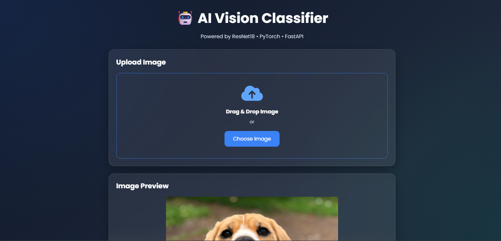
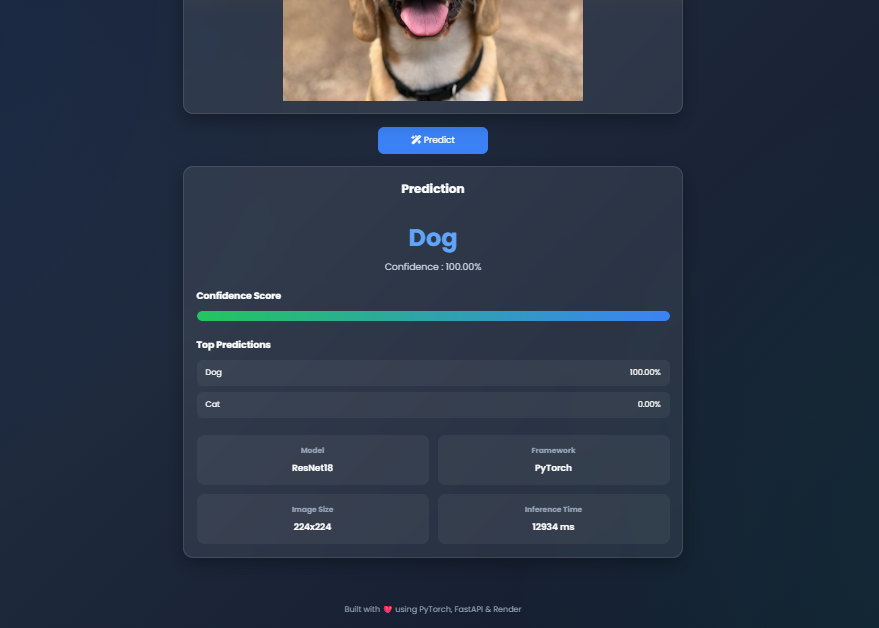

# 🐱🐶 AI Cats vs Dogs Image Classifier

An end-to-end Deep Learning project that classifies images of **Cats** and **Dogs** using **ResNet18** in PyTorch.

This project covers the complete AI development workflow—from data preprocessing and model training to backend API development, frontend integration, Dockerization, and cloud deployment.

---

## 🚀 Live Demo

🌐 **Frontend:** *https://catsvsdogsai-1.onrender.com*

🤖 **Backend API:** *https://grafterlalith-cats-vs-dogs-ai.hf.space*

📄 **Swagger API:**  
`https://grafterlalith-cats-vs-dogs-ai.hf.space/docs`

---

# 📸 Demo

### Home Page



### Prediction



---

# ✨ Features

- Image Upload
- Cat vs Dog Prediction
- Confidence Score
- Top Predictions
- FastAPI REST API
- Swagger Documentation
- Responsive Frontend
- Docker Deployment
- Hugging Face Spaces
- Render Frontend

---

# 🧠 Model

| Item | Details |
|------|---------|
| Architecture | ResNet18 |
| Framework | PyTorch |
| Classes | Cat, Dog |
| Input Size | 224×224 |
| Loss | CrossEntropyLoss |
| Optimizer | Adam |
| Learning Rate | 0.0001 |

---

# 📂 Dataset

Microsoft Cats vs Dogs Dataset

- Cats: 12,500 images
- Dogs: 12,500 images

---

# 📚 Learning Notebook

This repository also includes the **initial training notebook** developed during the learning phase.

The notebook covers:

- Understanding Image Data
- Image Dimensions
- RGB Channels
- Image Preprocessing
- Tensor Conversion
- Normalization
- Data Augmentation
- ImageFolder Dataset
- DataLoader
- Train / Validation Split
- Transfer Learning
- ResNet18 Architecture
- Model Training
- Validation
- Saving Best Model
- Single Image Prediction

The notebook documents the complete learning journey before building the production-ready backend.

---

# 🏗 Project Structure

```text
CatsVSDogsAI/

│
├── backend/
│   ├── app.py
│   ├── model.py
│   ├── predict.py
│   ├── best_model.pth
│   ├── Dockerfile
│   ├── requirements.txt
│
├── frontend/
│   ├── index.html
│   ├── style.css
│   ├── script.js
│
├── notebooks/
│   └── CatsVsDogs_Training.ipynb
│
├── screenshots/
│
├── README.md
└── LICENSE
```

---

# 🔄 AI Pipeline

```text
Dataset
      │
      ▼
Preprocessing
      │
      ▼
Data Augmentation
      │
      ▼
ImageFolder
      │
      ▼
DataLoader
      │
      ▼
ResNet18
      │
      ▼
Training
      │
      ▼
Validation
      │
      ▼
Best Model
      │
      ▼
FastAPI Backend
      │
      ▼
Docker
      │
      ▼
Hugging Face Spaces
      │
      ▼
Frontend
```

---

# 🛠 Tech Stack

## Deep Learning

- PyTorch
- TorchVision
- NumPy
- Pillow

## Backend

- FastAPI
- Uvicorn

## Frontend

- HTML
- CSS
- JavaScript

## Deployment

- Docker
- Hugging Face Spaces
- Render

## Tools

- VS Code
- Kaggle
- Git
- GitHub

---

# ⚙ Installation

## Clone Repository

```bash
git clone https://github.com/YOUR_USERNAME/CatsVSDogsAI.git

cd CatsVSDogsAI
```

---

## Install Dependencies

```bash
pip install -r requirements.txt
```

---

## Run Backend

```bash
uvicorn app:app --reload
```

---

## Open Swagger

```
http://127.0.0.1:8000/docs
```

---

# 📡 API Endpoints

## GET /

Returns API status.

---

## GET /health

Health check endpoint.

---

## POST /predict

Upload an image and receive predictions.

Example Response

```json
{
  "prediction":"Dog",
  "confidence":99.84,
  "top_predictions":[
      {
          "label":"Dog",
          "confidence":99.84
      },
      {
          "label":"Cat",
          "confidence":0.16
      }
  ]
}
```

---

# 🎯 Skills Demonstrated

- Deep Learning
- Computer Vision
- Transfer Learning
- Image Classification
- PyTorch
- FastAPI
- REST API Development
- Docker
- Hugging Face Spaces
- Frontend Integration
- Cloud Deployment
- Git & GitHub

---

# 📈 Future Improvements

- Grad-CAM Explainability
- Batch Prediction
- ONNX Export
- TensorRT Optimization
- Mobile Deployment
- User Authentication
- Prediction History
- Database Integration

---

# 👨‍💻 Author

**D.Lalith Sai**

IIIT NUZVID,
B.Tech Computer Science Engineering

Interested in:

- Artificial Intelligence
- Deep Learning
- Computer Vision
- Full Stack AI
- Medical AI
- AI Research

---

# ⭐ Acknowledgements

- PyTorch
- TorchVision
- Hugging Face
- FastAPI
- Kaggle
- Microsoft Cats vs Dogs Dataset

---

⭐ If you like this project, consider giving it a star!